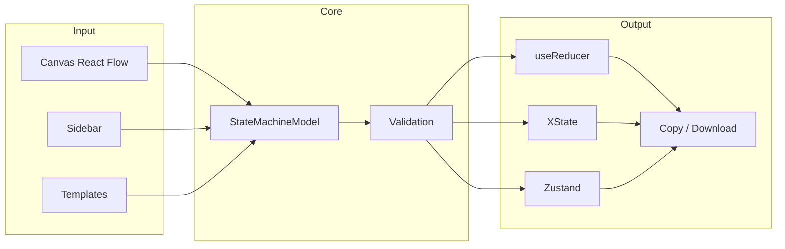

# Visual State Machine Builder

Design UI state machines visually and export type-safe code for **useReducer**, **XState**, or **Zustand**. Focus on loading, success, error, and empty states with full TypeScript inference.

## Demo

**Workflow:** Open a template → add states and connect them on the canvas → pick output format (useReducer / XState / Zustand / Tanstack) → Copy code or Download .ts. Use **History** to reopen recent diagrams saved in the app.

## Quick start (2 min)

```bash
git clone https://github.com/Nokimalos/visual-state-machine-builder.git
cd visual-state-machine-builder
npm install
npm run dev
```

1. Open http://localhost:5173
2. Click the **Async fetch** template
3. Click **Copy code** (or choose **XState** / **Zustand** in the sidebar first)
4. Paste into your React component or a new file

Example usage with the generated useReducer code:

```tsx
const [state, dispatch] = useReducer(asyncFetchReducer, initialAsyncFetchState);

// e.g. trigger fetch
dispatch({ type: 'FETCH' });
// on success
dispatch({ type: 'SUCCESS', payload: { data: result } });
```

## Architecture



- **Model:** [src/model/types.ts](src/model/types.ts) — `StateMachineModel`, `StateNode`, `Transition`. Single source of truth, serializable to JSON.
- **Editor state:** [src/store/editorStore.ts](src/store/editorStore.ts) — undo/redo, CRUD on states and transitions.
- **Generators:** [src/generators/](src/generators/) — `useReducer.ts`, `xstate.ts`, `zustand.ts` produce typed code from the model.

## Generated code examples

### Async fetch (useReducer)

```ts
export type AsyncFetchState =
  | { status: 'idle' }
  | { status: 'loading' }
  | { status: 'success'; data: T }
  | { status: 'error'; error: string };

export type AsyncFetchAction =
  | { type: 'FETCH' }
  | { type: 'SUCCESS'; payload: { data: T } }
  | { type: 'ERROR'; payload: { error: string } }
  | { type: 'RETRY' };

export function asyncFetchReducer(state: AsyncFetchState, action: AsyncFetchAction): AsyncFetchState {
  switch (action.type) {
    case 'FETCH': return { status: 'loading' };
    case 'SUCCESS': return { status: 'success', data: action.payload.data };
    case 'ERROR': return { status: 'error', error: action.payload.error };
    case 'RETRY': return { status: 'loading' };
    default: return state;
  }
}
```

### List with empty (useReducer)

Same pattern with states: `idle`, `loading`, `success` (with `data: T[]`), `empty`, `error`. Events: `FETCH`, `SUCCESS`, `EMPTY`, `ERROR`, `RETRY`.

### Form submit (useReducer)

States: `idle`, `submitting`, `success`, `error`. Events: `SUBMIT`, `SUCCESS`, `ERROR`, `DISMISS`.

---

## Scripts

| Command   | Description        |
| --------- | ------------------ |
| `npm run dev`    | Start dev server   |
| `npm run build` | Production build   |
| `npm run lint`  | Run Oxlint        |
| `npm run preview` | Preview production build |

## License

MIT — see [LICENSE](LICENSE).
